> ## 2-3 데이터 탐색(SELECT, FROM, WHERE)
---

### SQL 쿼리 구조
```
SELECT : 테이블의 어떤 컬럼을 출력할 것인지
 Col1 AS new_name(별칭), : 출력 시 Col1을 다른 이름으로 출력하겠다는 것을 의미
 Col2,
 Col3
FROM `Dataset.Table` : 어떤 테이블에서 데이터를 확인할 것인지
WHERE : 원하는 조건문 기재

작동 순서 : FROM -> WHERE -> SELECT
작성 순서 : SELECT -> FROM -> WHERE

데이터를 활용하고 싶은 목적에 따라 컬럼 선택

컬럼 이름에 따옴표X
컬럼에서 어떠한 값을 찾을 때 따옴표 활용

가독성있게 tab 활용하기!

; 세미콜론을 활용해 쿼리를 구분

범위 선택 후 실행도 가능
```
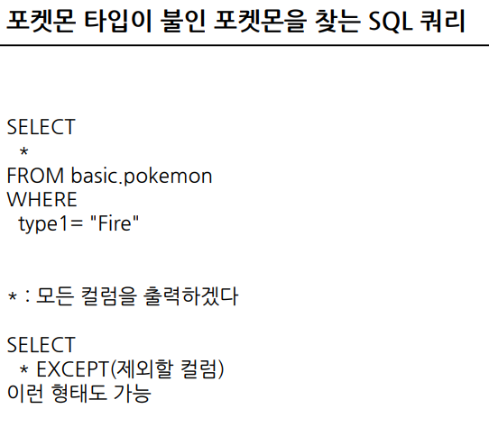

### 데이터가 여러 장소에 저장되어 있는 경우
```
특정 Table에서 데이터를 각각 추출한 후, 연결되는 부분을 기반으로 JOIN 진행 
```
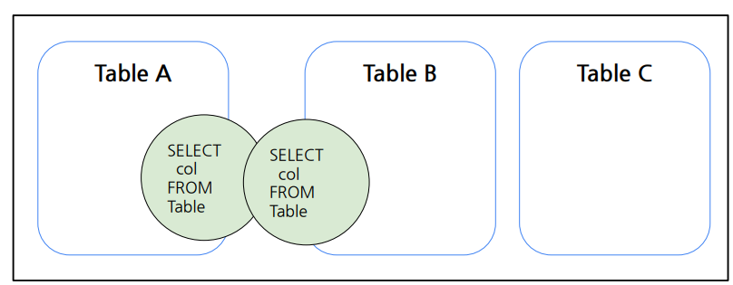
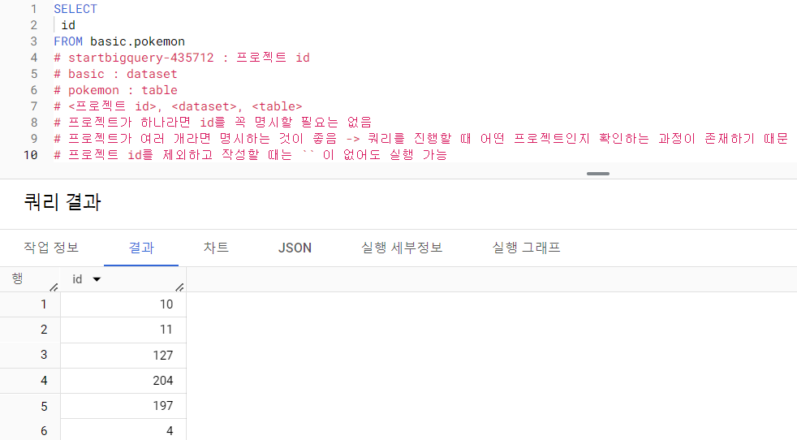

옆 키보드 아이콘을 통해 단축키 확인 가능 :

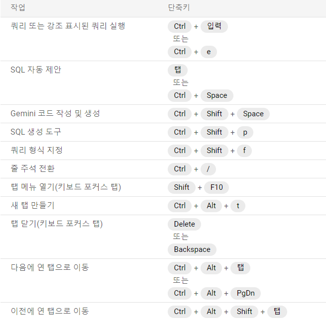
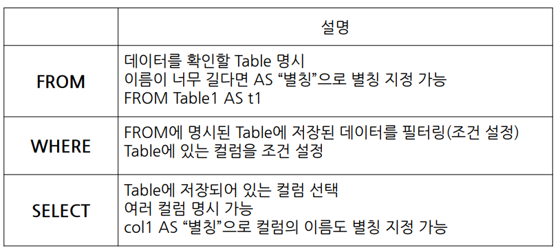

> ## 2-4 Select 연습문제
---
1. trainer 테이블에 있는 모든 데이터 출력

    문제 풀이 결과 :
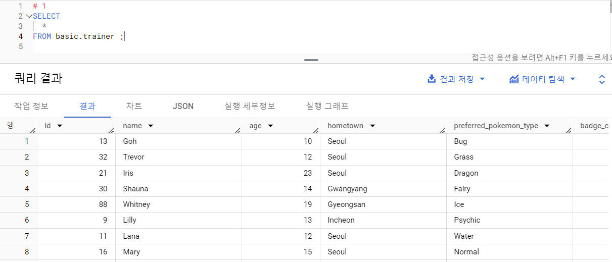

2. trainer 테이블에 있는 트레이너의 name을 출력

    문제 풀이 결과 :
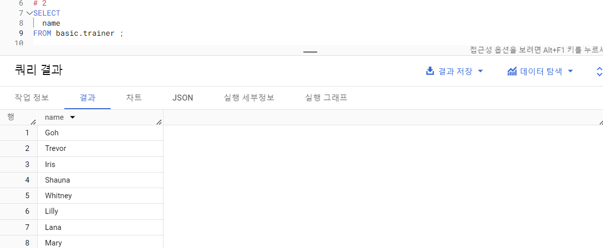

3. trainer 테이블에 있는 트레이너의 name, age를 출력

    문제 풀이 결과 :
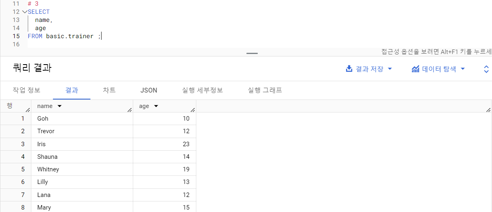

4. trainer의 데이터블에서 id가 3인 트레이너의 name, age, hometown을 출력

    문제 풀이 결과 :


5. pokemon 테이블에서 '피카츄'의 공격력과 체력을 확인할 수 있도록 출력

    문제 풀이 결과 :


> ## 2-5 집계(GROUPBY + HAVING + SUM/COUNT)
---
```
집계 : 그룹화를 해서 계산한다

HAVING : 집계 후 조건 설정

SELECT
 집계할_컬럼1, : 기준점이 되는 컬럼
 집계 함수(COUNT, MAX, MIN...) : ex.AVG(attack) AS avg_attack
FROM Table
GROUP BY
 집계할_컬럼1

집계할 컬럼을 SELECT에 명시하고 그 컬럼을 꼭 GROUP BY에 작성
```

### 집계 함수 종류

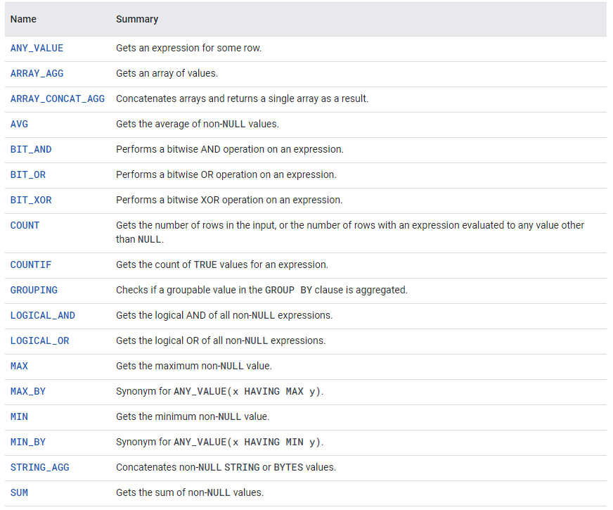

```
이 중에서 자주 사용하는 것:

- ARRAY_AGG
- AVG
- COUNT
- COUNTIF
- MAX
- MIN
- SUM
```

### DISTINCT : 고유값을 알고 싶은 경우

```
DISTINCT = 파이썬 UNIQUE

중복 제거 : DISTINCT or GROUPBY 활용
```
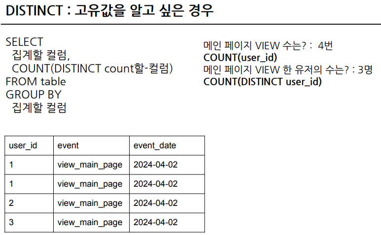

### GROUP BY 연습 문제

1. pokemon 테이블에 있는 포켓몬 수를 출력

    문제 풀이 결과 :
    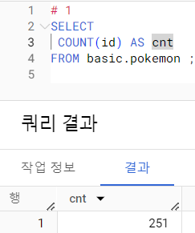

2. 포켓몬의 수가 세대별로 얼마나 있는지 출력

    문제 풀이 결과 :
    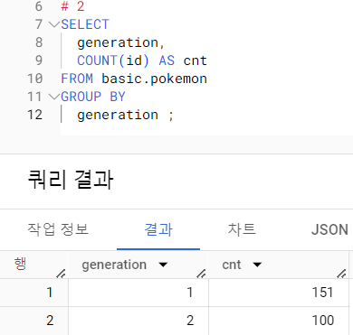

### 조건을 설정하고 싶은 경우
```
WHERE : 
- Table에 바로 조건을 설정하고 싶은 경우 사용
- Raw Data인 테이블 데이터에서 조건 설정

HAVING :
- GROUP BY를 한 후 조건을 설정하고 싶은 경우 사용
```
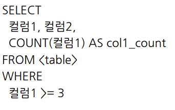
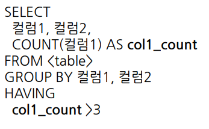

### 서브 쿼리
```
- SELECT문 안에 존재하는 SELECT 쿼리
- FROM 절에 또 다른 SELECT문을 넣을 수 있음
- 괄호로 묶어서 사용

서브 쿼리를 작성하고, 서브 쿼리 바깥에서 WHERE 조건 설정
= 서브 쿼리에서 HAVING 사용
```

### 정렬하기 : ORDER BY
```
SELECT
 Col
FROM
ORDER BY <컬럼><순서>

DESC : 내림차순
OSC : 오름차순
파이썬과 마찬가지로 오름차순이 Default

ORDER BY는 쿼리의 맨 마지막에만 작성하면 됨!
```

### 출력 개수 제한하기 : LIMIT
```
Row 수를 제한하고 싶은 경우 사용

쿼리문의 가장 마지막에 작성
ORDER BY 보다 밑
```

3. 포켓몬의 수를 타입 별로 집계하고, 포켓몬의 수가 10이상인 타입만 남기고 포켓몬 수가 많은 순으로 정렬해서 출력

    문제 풀이 결과 :
    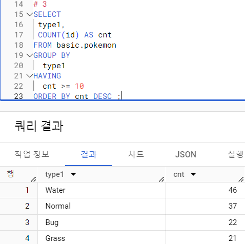
    
    -> 위에 텍스트에 기재한 것은 편의용, 위와 다르게 <>는 제외하고 단순한 컬럼명과 순서만 작성하기!

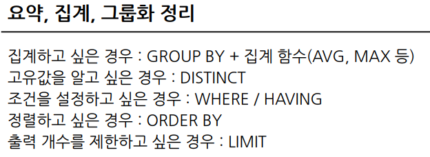