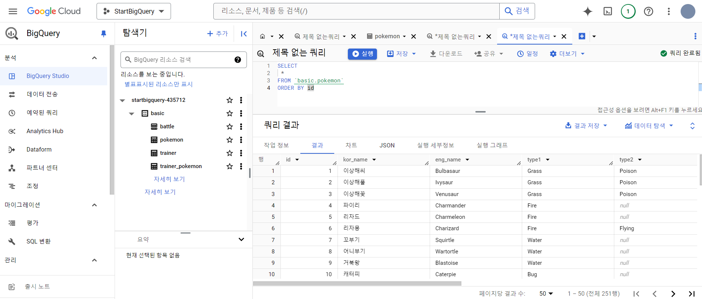
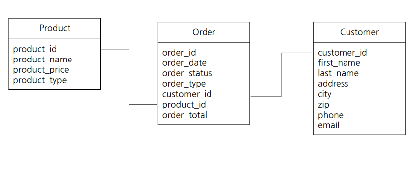
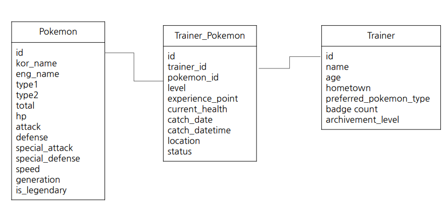

> ## 1-1. BigQuery 기초지식
---

### 데이터 저장 형태
```
DB : 데이터의 저장소
Table : 데이터가 저장된 공간
```

### MySQL, Oracle, PostgreSQL 특징
```
OLTP(Online Transaction Processing) :
- 거래를 하기 위해 사용되는 데이터 베이스
- 데이터 추가 및 변경이 많이 발생
- 분석을 목적으로 만든 데이터 베이스가 아니여서 쿼리 속도가 느릴 수 있음
SQL(Structured Query Languange) : 데이터 베이스에서 데이터를 가져올 때 사용하는 언어
```

## 테이블에 저장된 데이터의 형태
```
 Raw(원본 데이터) !=  Row(행)
```

### OLAP와 DW(데이터 웨어하우스)
```
OLAP(Online Analytical Processing) :
- OLTP의 속도 및 기능 부족으로 등장
- 분석을 위한 기능 제공

DW :
- 데이터를 한 곳에 모아서 저장
```

### BigQuery 장점
```
1. 쉬운 난이도
2. 빠른 속도
3. 쉽게 데이터 추출 가능
4. 서버를 띄울 필요 없음
```

> ## 1-2. BigQuery 환경 설정
---

### BigQuery 환경 구성 요소
```
1. 프로젝트 : 하나의 프로젝트에 여러 데이터셋이 존재할 수 있음
2. 데이터셋 : 하나의 데이터셋에 다양한 테이블이 존재할 수 있음
3. 테이블 : 행과 열로 이루어진 데이터들이 저장되어 있음
```


> ## 2-1. 데이터 활용 Overview
---

### 데이터를 활용하는 과정
```
데이터 탐색 및 데이터 결과 검증에 SQL을 사용

데이터 탐색 시 자주하는 4가지
1. 조건(필터링)
2. 추출
3. 변환
4. 요약
```

> ## 2-2. 저장된 데이터 확인하기
---

### SQL 퀴리를 작성하기 전에 생각해야 할 것
```
- 데이터가 어떻게 저장되어 있는지
- 어떤 데이터가 저장되어 있는지
- 컬럼의 의미는 무엇인지
```

### 데이터가 저장되는 형태를 알려면?
```
ERD(Entity Relationship Diagram) : 데이터 베이스 구조를 한 눈에 알아보기 위해서 사용
ERD가 없으면 모든 데이터 베이스를 직접 보면서 탐색하고 따로 정리해두기!
```

