> ## 2-6 연습 문제 1~3번 
---

1. 포켓몬 중에 type2가 없는 포켓몬의 수 출력

    문제 풀이 결과 :
    
    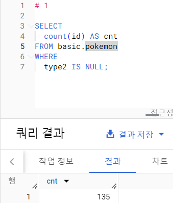
    
    WHERE 절에서 여러 조건을 연결하고 싶은 경우 'AND' 사용
    
    'OR' 경우 ( ) OR ( )로 괄호 필수!

2. type2가 없는 포켓몬의 type1과 type1의 포켓몬 수를 출력하고 type1의 포켓몬 수가 큰 순으로 정렬

    문제 풀이 결과 :
    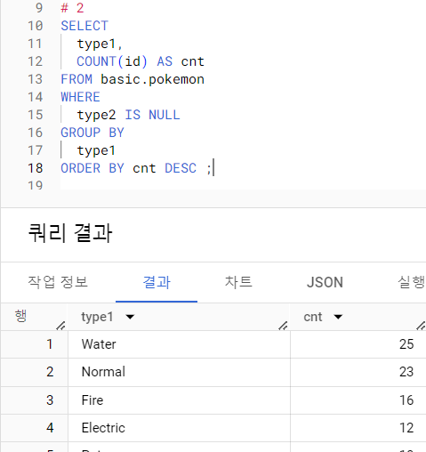

3. type2에 상관없이 type1의 포켓몬 수를 출력

    문제 풀이 결과 :
    
    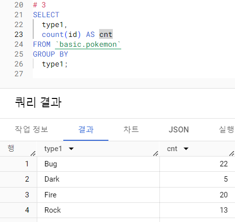
    
    여기서 COUNT(DISTINCT id)를 사용해도 동일한 결과가 나옴
     -> id를 중복 없이 설계했기 때문

    DISTINCT는 고유한 값을 알고 싶을 때 사용
     ex. DAU(Daily Active User) : Active한 유저의 수를 하루 단위로 집계

    어떤 컬럼은 중복이 있게 설계되니까 DISTINCT도 사용해보는 게 좋음

> ## 2-6 연습 문제 4~6번 
---

4. 전설 여부에 따른 포켓몬 수를 출력

    문제 풀이 결과 :
    
    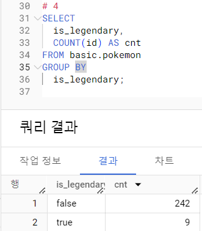

    GROUP BY 1 = SELECT의 첫 컬럼
    즉, 여기서 GROUP BY is_legendary = GROUP BY 1

    ORDER BY에서도 동일하게 적용됨

5. 동명이인이 있는 이름 출력

    문제 풀이 결과 :
    
    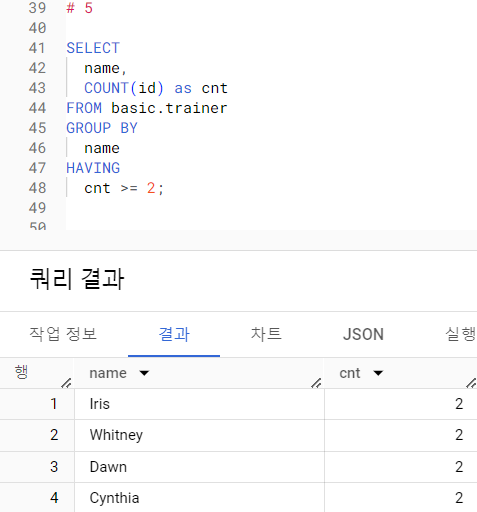

    부족했던 부분 :

    조건 : 동명이인 -> 같은 이름이 2개 이상 -> COUNT(name)

    강의에서 조건을 듣고 쿼리를 작성할 수 있었음
    조건의 흐름에 대해 더 깊이 고민할 수 있어야 함!


6. trainer 테이블에서 “Iris” 트레이너의 정보를 출력

    문제 풀이 결과 :
    
    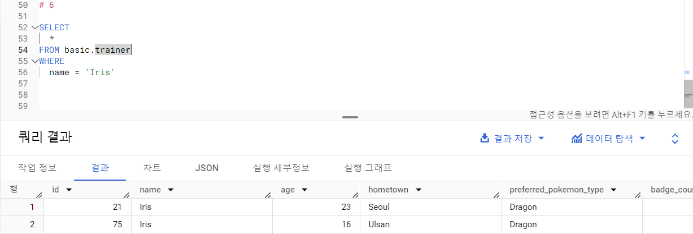

> ## 2-6 연습 문제 7~9번 
---

7. trainer 테이블에서 “Iris”, ”Whitney”, “Cynthia” 트레이너의 정보를 출력

    문제 풀이 결과 :

    1. 힌트 없이 :

    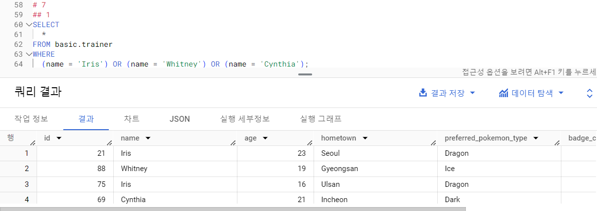
    
    2. 힌트 있이 :

    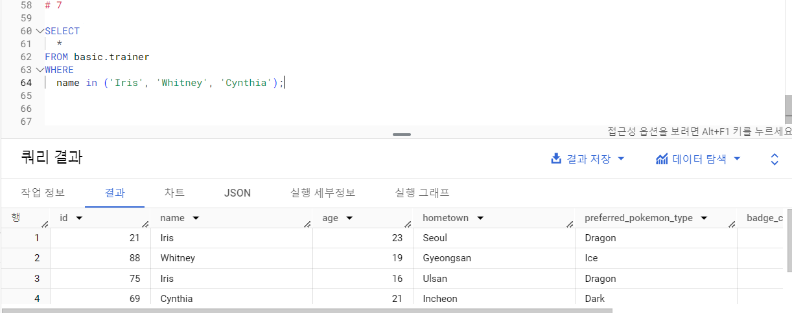

8. 전체 포켓몬 수 출력

    문제 풀이 결과 :
    
    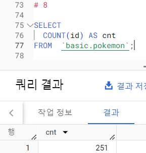

9. 세대(generation) 별로 포켓몬 수 출력

    문제 풀이 결과 :
    
    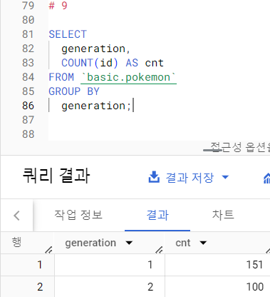

> ## 2-6 연습 문제 10~12번 
---

10. type2가 존재하는 포켓몬의 수 출력

    문제 풀이 결과 :
    
    


11. type2가 있는 포켓몬 중에 제일 많은 type1을 출력

    문제 풀이 결과 :
    
    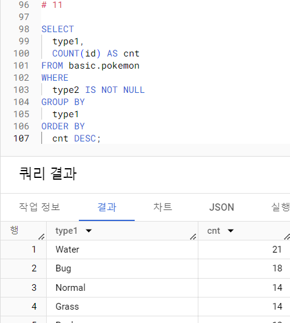

    부족했던 부분 :

    가장 많은 type1 하나만 출력하고 싶었지만 이 부분을 출력하지 못함

    강의를 듣고 LIMIT을 사용하면 됨을 이해

    수정된 풀이 결과 :

    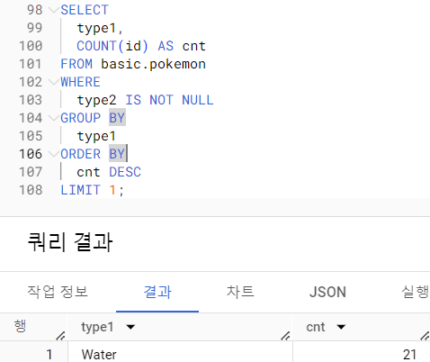


12. 단일(하나의 타입만 있는) 타입 포켓몬 중 많은 type1 출력

    문제 풀이 결과 :
    
    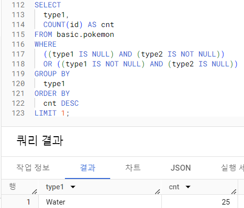

> ## 2-6 연습 문제 13~17번 
---

13. 포켓몬의 이름에 "파"가 들어가는 포켓몬 출력

    문제 풀이 결과 :

    1. 힌트 없이 :
    
    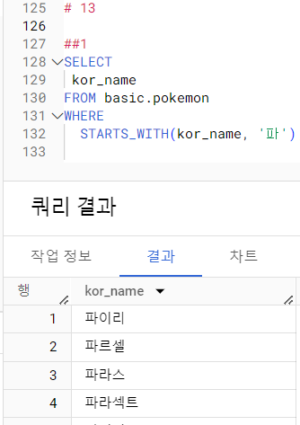

    파이썬의 개념으로 STARTS_WITH가 있어서 활용했는데 동일하게 정답 추출이 가능했음

    2. 힌트 있이 :

    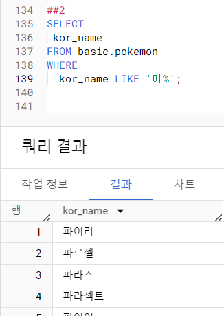

    LIKE 
    1. '특정단어%' : 특정단어로 시작
    2. '%특정단어' : 특정단어로 끝
    3. '%특정단어%' : 특정단어를 포함

14. 뱃지가 6개 이상인 트레이너 출력

    문제 풀이 결과 :
    
    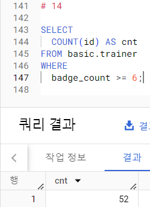

15. 트레이너가 보유한 포켓몬(trainer_pokemon)이 제일 많은 트레이너 출력

    문제 풀이 결과 :
    
    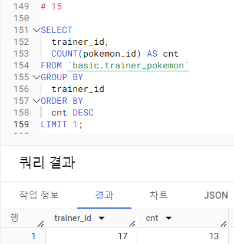

16. 포켓몬을 많이 풀어준 트레이너 출력

    문제 풀이 결과 :
    
    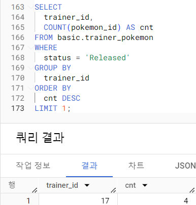

17. 트레이너 별로 풀어준 포켓몬의 비율이 20%가 넘는 포켓몬 트레이너 출력[풀어준 포켓몬의 비율 =(풀어준 포켓몬 수 / 전체 포켓몬의 수)]

    문제 풀이 결과 :
    
    

    부족했던 점 :

    힌트를 봐도 어떻게 풀어준 포켓몬의 비율을 계산해야 할 지 모름

    먼저, COUNTIF(조건)을 활용해 수를 계산해야 하고,
    SELECT문에서 AS 뒤에 정의한 이름을 바로 반영해서 쓸 수 없음! 

> ## 2-7 정리 
---

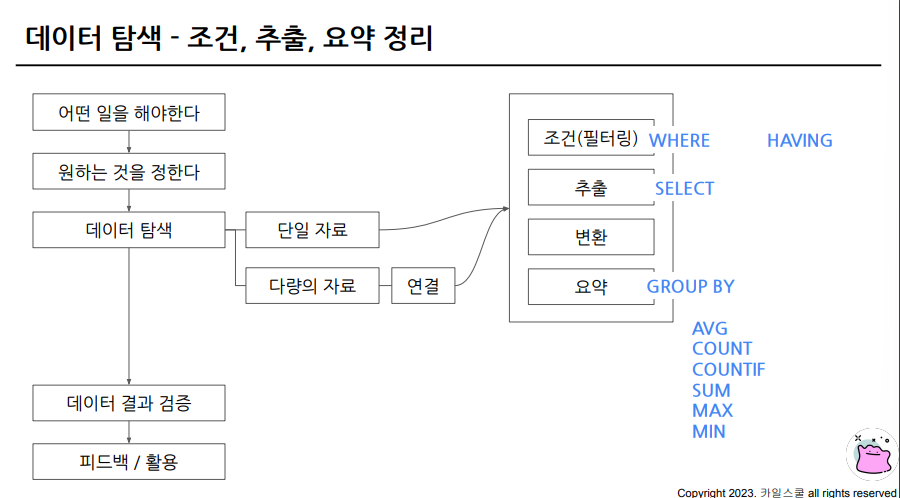

> ## 2-8 새로운 집계 함수 소개(GROUP BY ALL) 
---

```
기존 GROUP BY 사용법
```
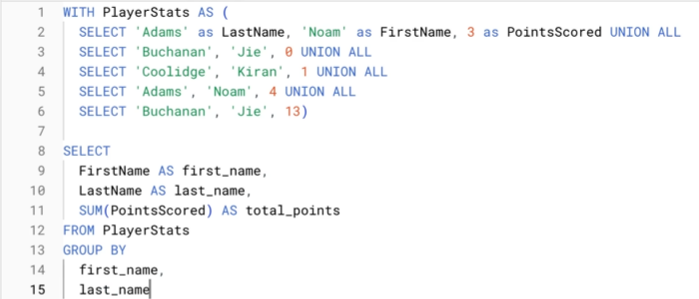

```
새로운 GROUP BY ALL 사용법

GROUP BY ALL은 그룹화할 키를 알아서 컬럼을 추론
```
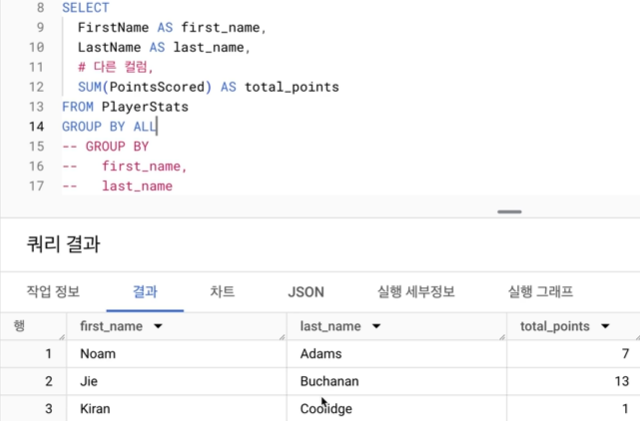

> ## 3-1 Intro
---

> ## 3-2 SQL 쿼리를 작성하는 흐름
---
```
지표 고민과 동시에 문제 정의 필요
```


```
지표가 있는 경우 있는 지표를 활용, 없는 경우 구글 검색해서 사용하는 지표 확인
```


```
지표 고민, 데이터 정합성 확인, 가독성 있게 쿼리를 작성하고 저장
 -> 이 부분이 가장 중요!!!
```
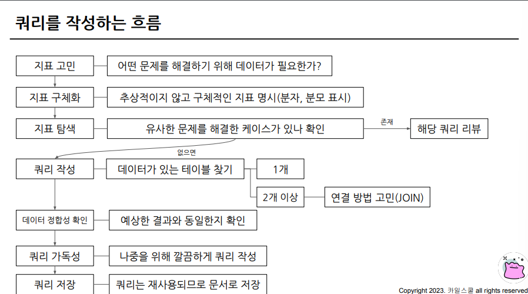

> ## 3-3 쿼리 작성 템플릿과 생산성 도구
---
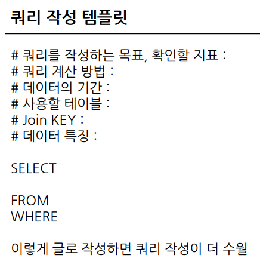

### 생산성 도구 : Espanso

```
특정 단어를 입력하면 원하는 문장(템플릿)으로 변경

특정 단어가 감지되면 정의된 것으로 바꿈
```
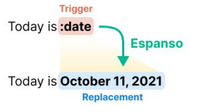


```
':sql'을 작성하면 아래처럼 바로 변환됨
```
```
# 쿼리를 작성하는 목표, 확인할 지표 :
# 쿼리 계산 방법 :
# 데이터의 기간 :
# 사용할 테이블 :
# Join KEY :
# 데이터 특징 :

SELECT

FROM
WHERE

신기신기
```
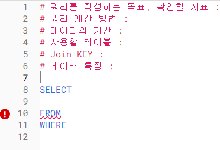


