> ## 3-4 오류를 디버깅하는 방법
---

```
오류를 바라보는 관점 : 길잡이가 나를 더 좋은 길로 나아가게 하려는구나!
```

### BigQuert Error
```
대표적인 오류 카테고리 : Syntax Error(문법 오류)
```
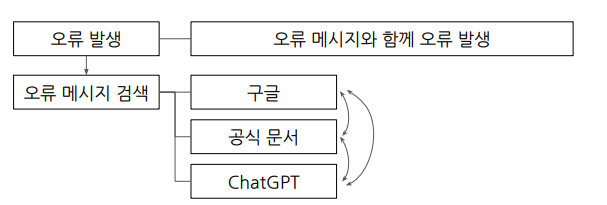

### BigQuert Error : SELECT list must not be empty at [10:1]

```
뜻 : SELECT 목록은 [10:1]에서 비어 있으면 안됨

아래 사진처럼 빨간 밑줄 앞이나 뒤에서 오류가 발생했을 가능성이 큼
```
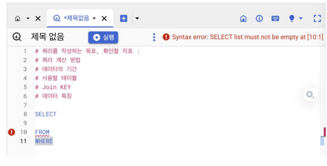

### BigQuert Error : Number of arguments does not match for aggregate function COUNT

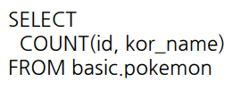
```
뜻 : 집계 함수 COUNT의 인자 수가 일치하지 않음

COUNT 함수 안에는 인자가 한 개만 들어감!
```

### BigQuert Error : SELECT list expression references column type1 a which is neither grouped nor aggregated

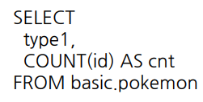
```
뜻 : SELECT 목록식은 다음에서 그룹화되거나 집계되지 않은 열을 참조함

GROUP BY에 적절한 컬럼을 명시하지 않았기 때문에 오류 발생
```
### BigQuert Error : Expected end of input but got keyword SELECT

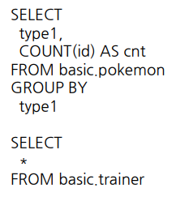
```
뜻 : 입력이 끝날 것으로 예상되었지만 SELECT 키워드가 입력됨

- 하나의 쿼리에는 SELECT가 1개만 있어야 함
- 쿼리가 끝나는 부분에 ;를 붙이고 실행할 부분만 드래그해서 실행하면 됨
```

### BigQuert Error : Expected end of input but got keyword WHERE at [5:1]

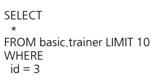
```
뜻 : 입력이 끝날 것으로 예상되었지만 [5:1]에서 키워드 WHERE을 얻음

해당 오류가 발생하는 이유는 LIMIT 때문
 -> LIMIT을 삭제하거나 가장 마지막줄로 옮기면 오류 해결
```

### BigQuert Error : Expected ")" but got end of script at [8:11]

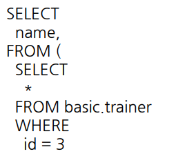
```
뜻 : ")"가 있어야 하는데 [8:11]에서 스크립트가 끝남

괄호를 작성하지 않아서 오류 발생
```

> ## 4-1 Intro
---

```
데이터 변환에 대해서 공부!
```
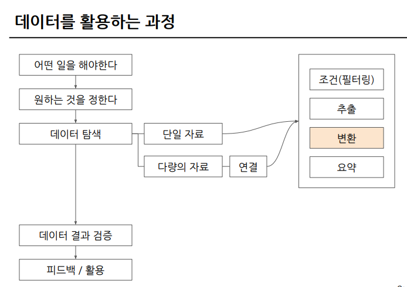

> ## 4-2 데이터 타입과 데이터 변환(CAST, SAFE_CAST) 
---

### 변환을 위한 함수

```
SELECT문에서 데이터를 변환시킬 수 있음
```

### 데이터 타입

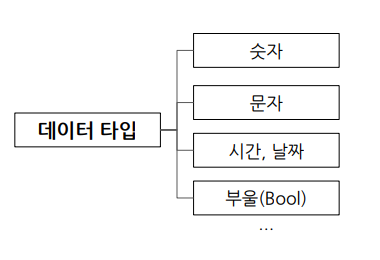

### 데이터 타입이 중요한 이유

```
보이는 것과 저장된 것의 차이가 존재하기 때문!

내 생각과 다른 경우 데이터 타입을 변경해야 함!
```
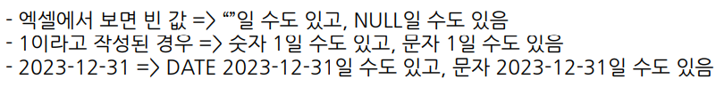

### 자료 타입 변경하기

```
자료 타입을 변경하는 함수 : CAST

SELECT
 CAST(? AS ?(원하는 데이터 타입))

- 아래 사진처럼 문자열의 경우 숫자로 변경 불가(파이썬과 동일함)
```
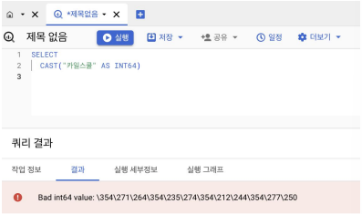

```
더 안전하게 데이터 타입 변경 : SAFE_CAST

SAFE_가 붙은 함수는 변환이 실패하면 NULL로 반환

SELECT
 SAFE_CAST(? AS ?(원하는 데이터 타입))

- 아래 사진처럼 문자열의 경우 숫자로 변경 불가(파이썬과 동일함)
```
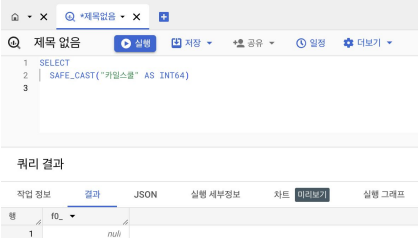

### 수학 함수

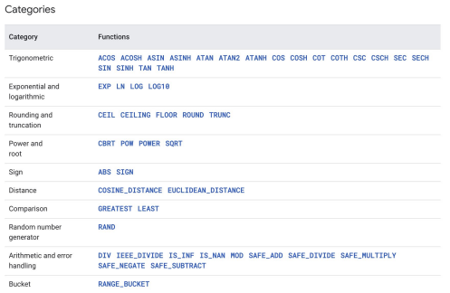
```
수학 함수에는 수학 연산 (평균, 표준 편차, 코사인 등)이 존재

사용할 것 위주로 기억하고, 필요할 때 찾으면 됨!

SAFE_DIVIDE(x, y) 함수 사용 권장!!

'x / y'의 경우 둘 중 하나의 값이 0이면 ZERO ERROR 발생 

SAFE_DIVIDE를 사용하면 NULL반환
```

> ## 4-3 문자열 함수(CONCAT, SPLIT, REPLACE, TRIM, UPPER)
---

### 문자열(STRING) 함수

```
문자열 데이터로 할 수 있는 대표적인 연산 :
```
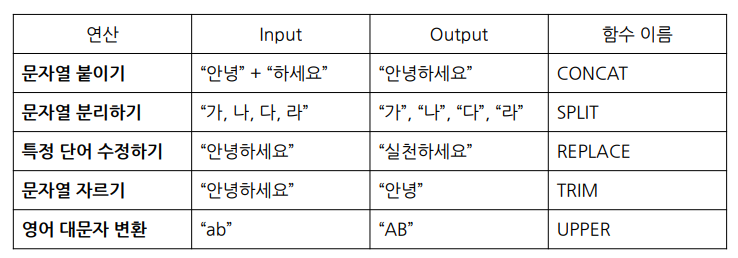

```
문자열 합치기 : CONCAT

문법 : CONCAT(컬럼1,컬럼2,…)

예시 :

- FROM이 없어도 작동하는 이유 : CONCAT 인자로 STRING이나 숫자를 넣는 경우 이는 데이터를 직접 넣어준 것이기 때문 
```
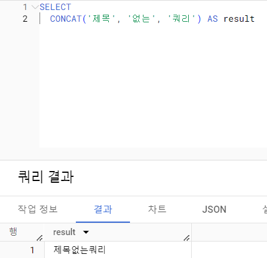

```
문자열 분리 : SPLIT

문법 : SPLIT(문자열 원본, 나눌 기준이 되는 문자) 

예시 :

```
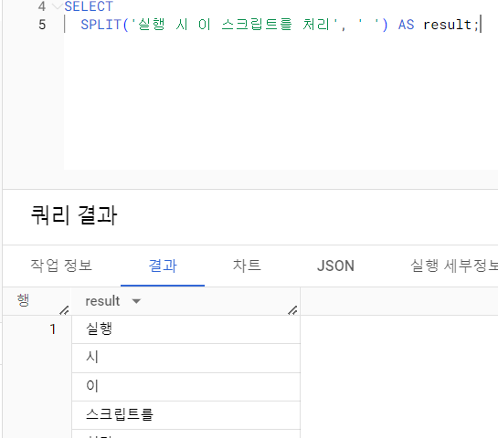
```
특정 단어 수정 : REPLACE

문법 : REPLACE(문자열 원본, 찾을 단어, 바꿀 단어)

예시 :
```
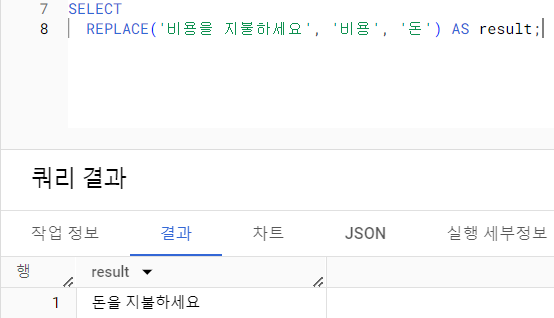

```
문자열 자르기 : TRIM 

문법 : TRIM(문자열 원본, 자를 단어)

예시 :
```
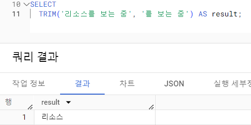

```
대문자 변환 : UPPER 

문법 : UPPER(문자열 원본)

예시 :
```
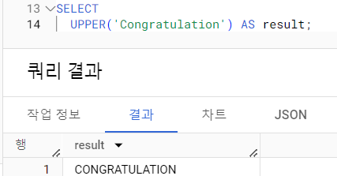

> ## 4-4 날짜 및 시간 데이터 이해하기(1)(타임존, UTC, Millisecond, TIMESTAMP/DATETIME)
---

### 날짜 및 시간 데이터의 핵심

```
시간 : 
- created at : 언제 생성되었는가
- updated at : 언제 변경되었는가

시간이 흐름에 따른 데이터 분석!
```
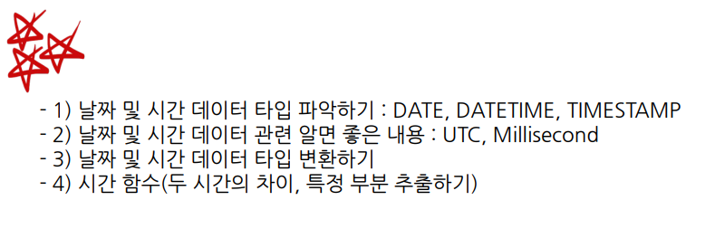

### 시간 데이터 다루기

```
DATE : 날짜만 표시하는 데이터 
TIME : 시간만 표시하는 데이터
DATETIME : 날짜와 시간을 표시하는 데이터
```

### 시간 데이터 다루기 - 타임존

```
한국 시간 : GMT+9, UTC+9

여기서 GMT란?

GMT : Greenwich Mean Time
-> 영국의 그리니치 천문대 (경도 0도)를 기준으로 지역에 따른 시간 차이를 조정하기 위한 구분선

여기서 UTC란?
UTC : Universal Time Coordinated
 -> 국제적인 표준 시간(협정 세계시)

TIMESTAMP : UTC부터 경과한 시간을 나타내는 값
- Time Zone 정보가 있음(ex. 2023-12-31 14:00:00 UTC)
```

### 시간 데이터 다루기 - millisecond, microsecond

```
millisecond(ms) : 천분의 1초
- 1,000ms = 1초
- 빠른 반응이 필요한 분야에서 사용
-> 초 단위보다 더 정밀&정확하게 데이터를 위해서 사용
- Millisecond -> TIMESTAMP -> DATETIME으로 변경해서 사용

microsecond(µs)
- 1/1,000ms, 1/1,000,000초

TIMESTAMP_MILLIS : millisecond를 TIMESTAMP로 변환
TIMESTAMP_MICROS : microsecond를 TIMESTAMP로 변환
DATETIME(TIMESTAMP_MILLIS(?), '?'(원하는 타임존 입력))

올바른 예시 : ?ms

SELECT
 TIMESTAMP_MILLIS(?) AS milli_to_timestamp,
 TIMESTAMP_MICROS(?*1000) AS micro_to_timestamp,
 DATETIME(TIMESTAMP_MILLIS(?), 'Asia/Seoul') AS datetime;

타임존 입력을 안하면 UTC 시간이 출력되어 해석에 오류 발생

'타임존 입력을 잊지 말자!!'
```
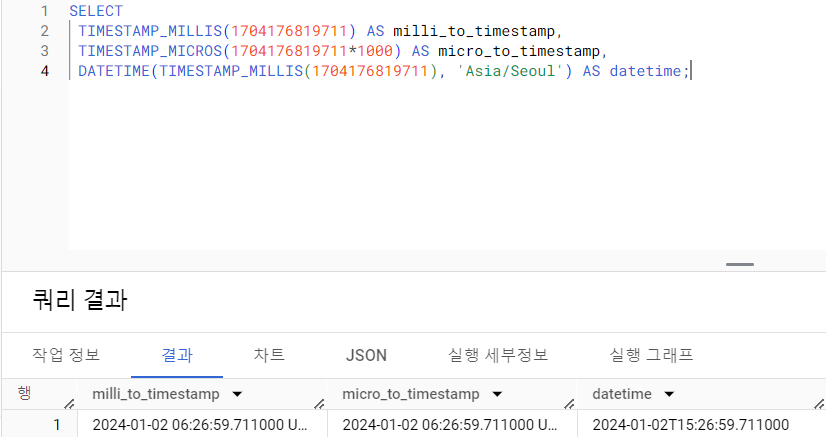

### 시간 데이터끼리의 변환

```
회사에서 저장된 유형에 따라
TIMESTAMP -> DATETIME로 변환해야 할 수 있음
```

### TIMESTAMP와 DATETIME 비교

```
CURRENT_TIMESTAMP : 현재의 TIMESTAMP를 알려주는 함수

SELECT
 CURRENT_TIMESTAMP() AS Timestamp_now,
 DATETIME(CURRENT_TIMESTAMP(), 'Asia/Seoul') AS Datetime
```
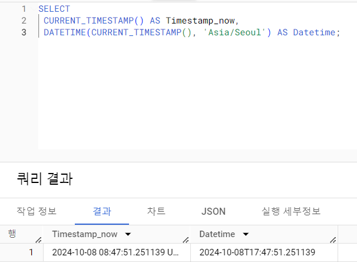
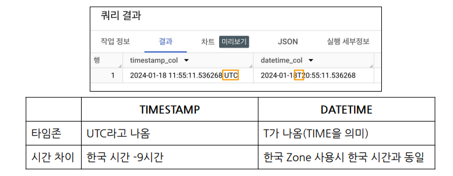