> ## 4-4 날짜 및 시간 데이터 이해하기(2)(EXTRACT, DATETIME_TRUNC, PARSE_DATETIME, FORMAT_DATETIME)
---

### DATETIME 함수 - EXTRACT

```
EXTRACT(특정 파트 FROM DATETIME_EXPRECTION)

특정 파트에 들어갈 수 있는 것 :

- 우리가 일반적으로 알고 있는 대부분 시간 표현을 추출할 수 있음

그 중에서 

1. WEEK :
 1년은 53주차까지 있으므로 그 범위에서 몇 주차인지 알려주는 것

2. WEEKDAY :
 WEEK은 SUNDAY 기준으로 시작
 WEEKDAY를 통해 이 시작일을 바꿀 수 있음

요일을 추출하고 싶은 경우 :
EXTRACT(DAYOFWEEK FROM datetime_col)

- 한 주의 첫 날이 일요일인 [1,7] 범위의 값을 반환
```
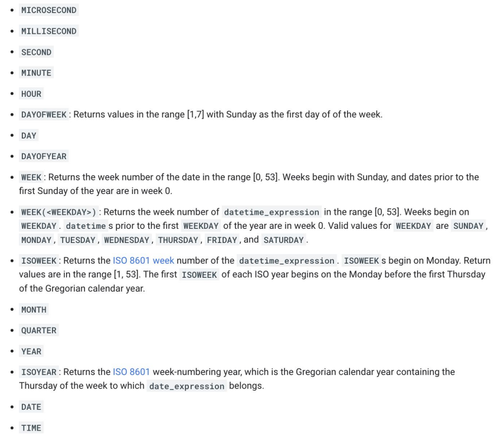
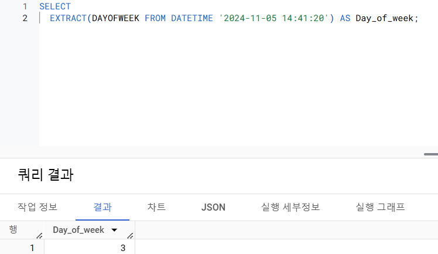

### DATETIME 함수 - DATETIME_TRUNC

```
DATE과 HOUR만 남기고 싶은 경우(HOUR 뒤에 시간을 0으로 처리) :

DATETIME_TRUNC(datetime_col, HOUR)
- "2024-01-02 14:42:13"을 HOUR로 자르면 "2024-01-02 14:00:00"
- DAY, YEAR, MONTH의 경우 나머지를 다 1로 바꿈
```
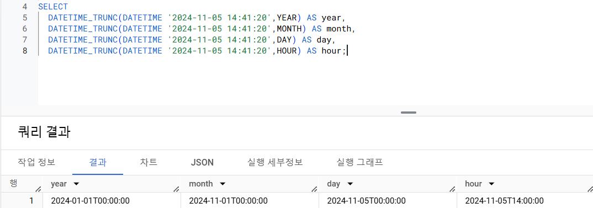

### DATETIME 함수 - PARSE_DATETIME

```
문자열로 저장된 DATETIME을 DATETIME으로 변경하고 싶은 경우 :

PARSE_DATETIME('문자열의 형태', 'DATETIME 문자열')AS datetime

SELECT
 PARSE_DATETIME('%Y-%m-%d %H:%M:%S, '2024-01-11 12:35:35') AS parse_datetime;
```
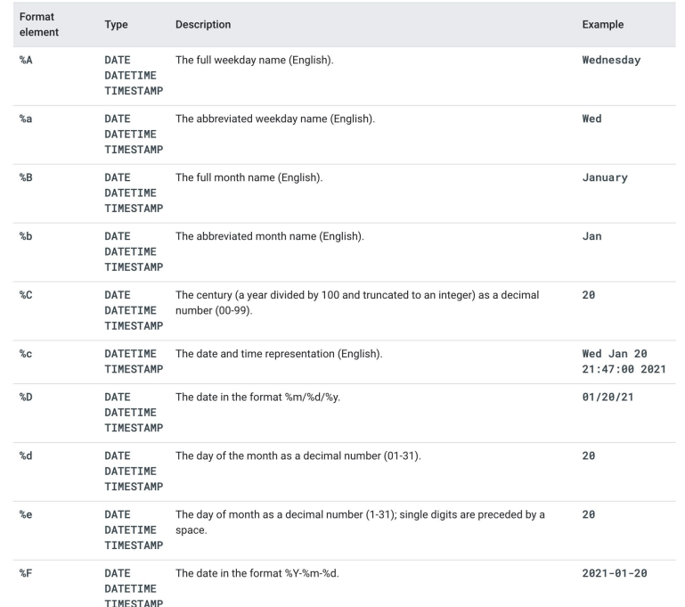

### DATETIME 함수 - FORMAT_DATETIME

```
DATETIME 타입 데이터를 특정 형태의 문자열 데이터로 변환하고 싶은 경우 :

SELECT
 FORMAT_DATETIME("%c", DATETIME "2024-01-11 12:35:35") AS formatted
```

### DATETIME 함수 - LAST_DAY

```
마지막 날을 알고 싶은 경우 :

SELECT
 LAST_DAY(DATETIME '2024-01-03 15:30:00') AS last_day

아래 사진에서 첫 번째 값과 두 번째 값이 동일한 이유 :

 지정하지 않았을 때 DEFAULT값이 MONTH이기 때문

마찬가지로 WEEK 또한 DEFAULT가 SUNDAY라 동일한 결과가 출력됨
```
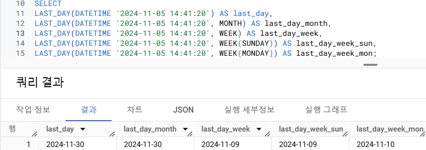

### DATETIME 함수 - DATETIME_DIFF

```
두 DATETIME의 차이를 알고 싶은 경우 :

DATETIME_DIFF(첫 DATETIME, 두 번째 DATETIME,궁금한 차이)

```
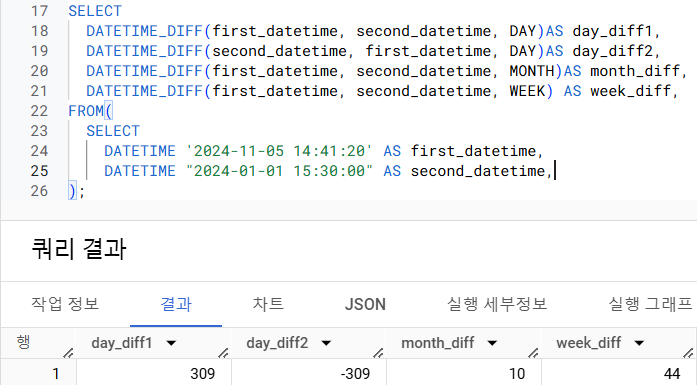

### 정리

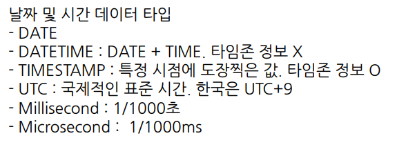
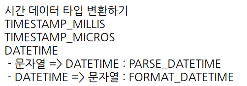


> ## 4-5 시간 데이터 연습 문제 1~2번
---

1. 트레이너가 포켓몬을 포획한 날짜(catch_date)를 기준으로, 2023년 1월에 포획한 포켓몬의 수를 계산

    문제 풀이 결과 :
    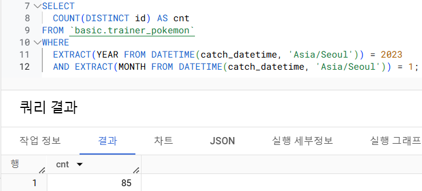

2. 배틀이 일어난 시간(battle_datetime)을 기준으로, 오전 6시에서 오후 6시 사이에 일어난 배틀의 수를 계산

    문제 풀이 결과 :
    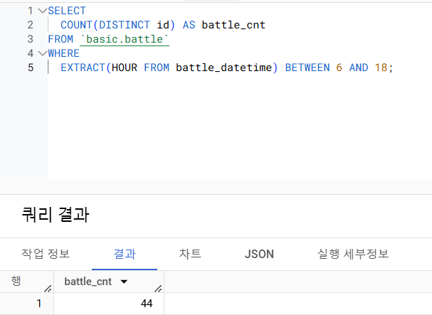

> ## 4-5 시간 데이터 연습 문제 3~5번
---

3. 각 트레이너별로 그들이 포켓몬을 포획한 첫날(catch_date)을 찾고, 그 날짜를 'DD/MM/YYYY' 형식으로 출력(2024-01-01=>01/01/2024)

    문제 풀이 결과 :
    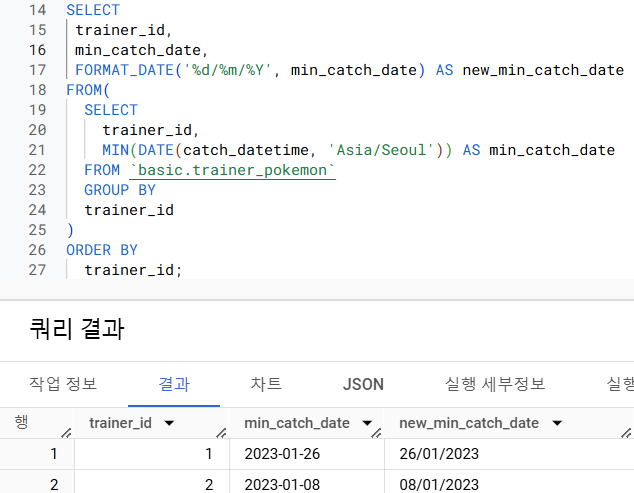

4. 배틀이 일어난 날짜(battle_date)를 기준으로, 요일별로 배틀이 얼마나 자주 일어났는지 계산

    문제 풀이 결과 :
    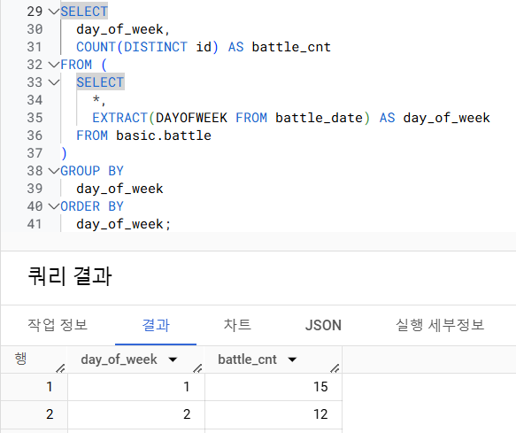

5. 트레이너가 포켓몬을 처음으로 포획한 날짜와 마지막으로 포획한 날짜의 간격이 큰 순으로 정렬

    문제 풀이 결과 :
    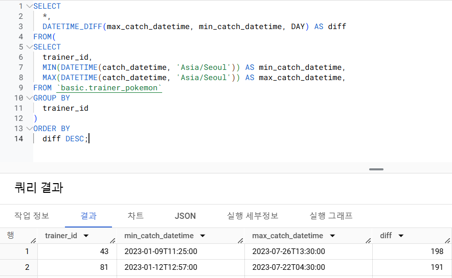

> ## 4-6 조건문(CASE WHEN, IF)
---

### 조건문 함수

```
조건문을 사용할 수 있는 2가지 방법 :

1. CASEWHEN
2. IF
```

### 조건문 : 1) CASEWHEN

```
SELECT
 CASE
  WHEN 조건1 THEN 조건1이 참일 경우 결과
  WHEN 조건2 THEN 조건2가 참일 경우 결과
  ELSE 그외 조건일 경우 결과
END AS 새로운_컬럼_이름

주의점 :
-조건1, 조건2에 둘다 해당하면 앞선 순서를 따름

순서 배치 중요!
```
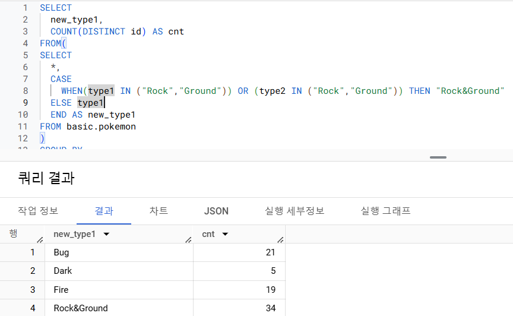

### 조건문 : 2) IF

```
단일 조건일 경우 유용

IF(조건문, True일 때의 값, False일 때의 값) AS 새로운_컬럼_이름
```
### 조건문 정리

```
1. CASEWHEN : 여러 조건이 있을 경우 사용
- 조건의 순서에 주의

2. IF : 단일 조건일 경우 사용
```

> ## 4-7 조건문 연습 문제
---

1. 포켓몬의 'speed'가 70이상 이면 '빠름', 그렇지 않으면 '느림'으로 표시하는 새로운 컬럼'Speed_Category'를 출력

    문제 풀이 결과 :
    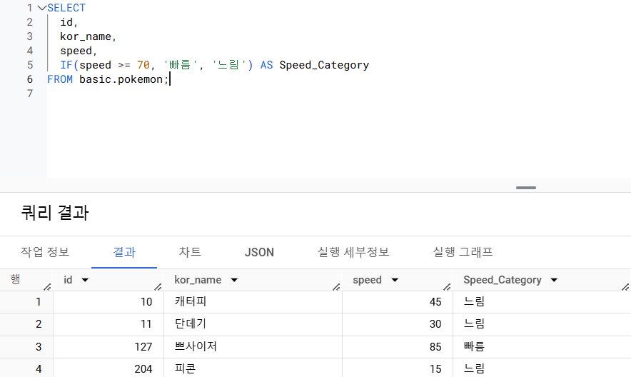

2. 포켓몬의 'type1'에 따라 'Water', 'Fire','Electric' 타입은 각각 '물','불','전기'로, 그외 타입은 '기타'로 분류하는 새로운 컬럼'type_Korean'을 출력

    문제 풀이 결과 :
    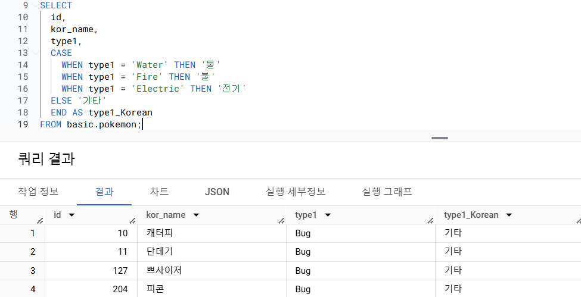

3. 각 포켓몬의 총점(total)을 기준으로, 300이하면 'Low',301에서 500사이면'Medium', 501이상이면 'High'로 분류

    문제 풀이 결과 :
    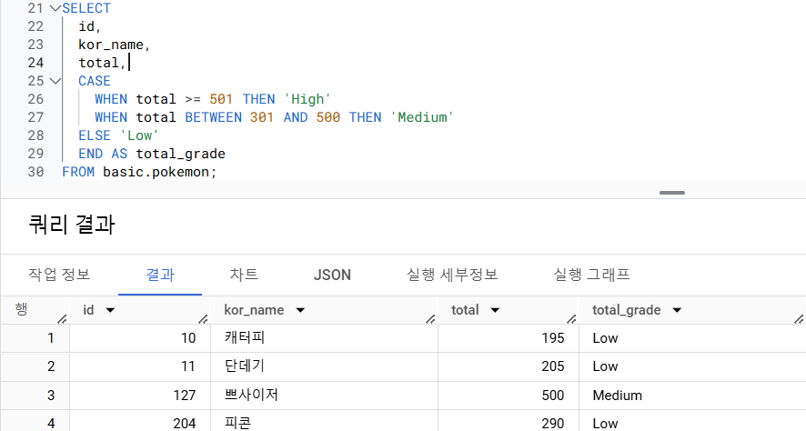

4. 각 트레이너의 배지 개수(badge_count)를 기준으로, 5개 이하면 'Beginner', 6개에서 8개 사이면 'Intermediate', 그 이상이면 'Advanced'로분류

    문제 풀이 결과 :
    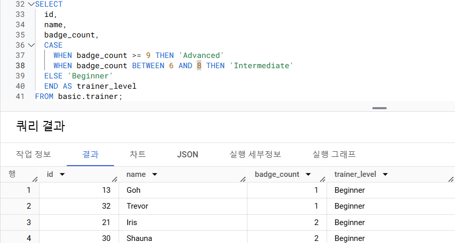

5. 트레이너가 포켓몬을 포획한날짜(catch_date)가 '2023-01-01' 이후면 'Recent', 그렇지 않으면 'Old'로 분류

    문제 풀이 결과 :
    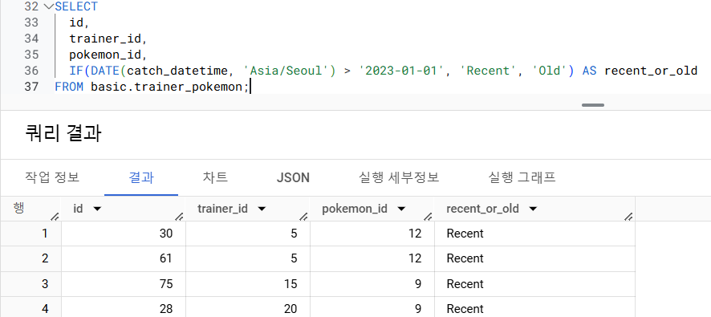

6. 배틀에서 승자(winner_id)가 player1_id와 같으면 'Player1Wins', player2_id와 같으면 'Player2Wins', 그렇지 않으면 'Draw'로 결과 출력

    문제 풀이 결과 :
    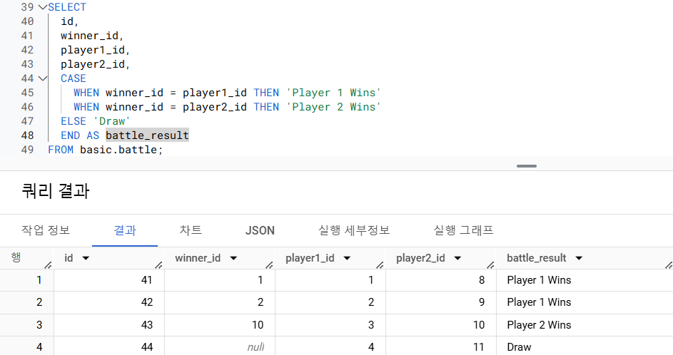

> ## 4-8 정리
---

### 컬럼변환하기정리

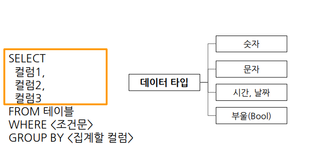

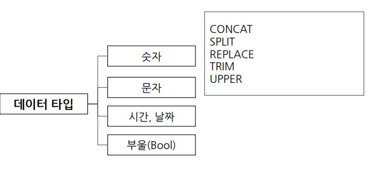
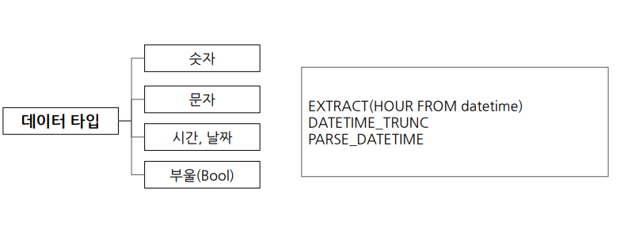
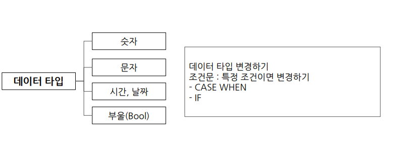

> ## 4-9 BigQuery 공식 문서 확인하는 법
---

### 개발 공식 문서

```
프로그래밍 언어,라이브러리 등은 해당 기술을 어떻게 사용하면 좋은지에 대해 문서를 제공

찾는 방법 :
“기술명 + documentation”으로검색
```

### 공식 문서를 꼭 봐야 하나?

```
공식문서"도" 볼 수 있어야 함

참고할 수 있는 여러 자료가 있지만, 잘못된 경우나 과거
문법인 경우가 종종 존재

필요할 때마다(목적에 맞게) 공식 문서를 보는 것이 좋음

흐름 :

어떤 작업을 해야 함 -> 찾아봄 -> A라는 함수를 상요해야 함 -> A 함수 공식 문서 보기
```

### 특정 작업을 하다가 어떻게 해야할지 모르겠다면

```
'특정 행위 in bigquery'라고 검색

원하는 것을 잘 찾는 과정 :

- 검색(ctrl+f) 활용
- Stackoverflow,GPT에서 키워드 힌트 찾고 검색
- 공식문서를 여유를 가지고 읽기
```

### 공식 문서 Slack RSS Feed 추가하기

```
Slack RSS Feed를 구독하면 BigQuery가 출시하는 새로운 기능을 바로 알 수 있음
```
