> ## 5-1 Intro
---

### 이번 파트에서 다룰 내용

```
JOIN : 다량의 자료를 연결하고 싶을 때 사용

- 포켓몬으로 JOIN 이해하기
- 다양한 JOIN 방법
- JOIN 쿼리 작성하기
- JOIN을 처음 공부할때 헷갈렸던 부분
- JOIN 연 습문제
```
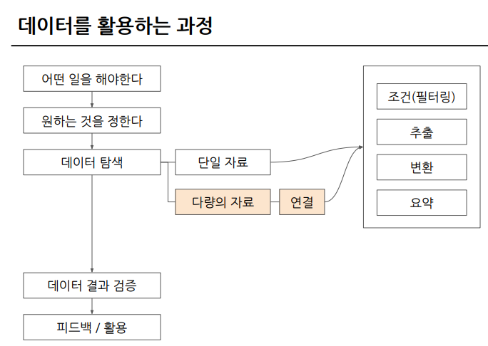

> ## 5-2 JOIN 이해하기
---

### SQL JOIN

```
쿼리 작성 -> 결과 확인(피드백) -> 다시 시도 -> 다시 결과 확인

보통 id값을 Key로 많이 사용
특정 범위(예 : Date)로 JOIN도 가능
```

### 포켓몬으로 JOIN 이해하기

```
트레이너 데이터와 포켓몬 데이터 둘 만으로는 공통된 컬럼이 없기 때문에 JOIN이 불가능

아래 사진처럼 트레이너가 포획한 포켓몬 데이터를 통해 연결 가능 
```
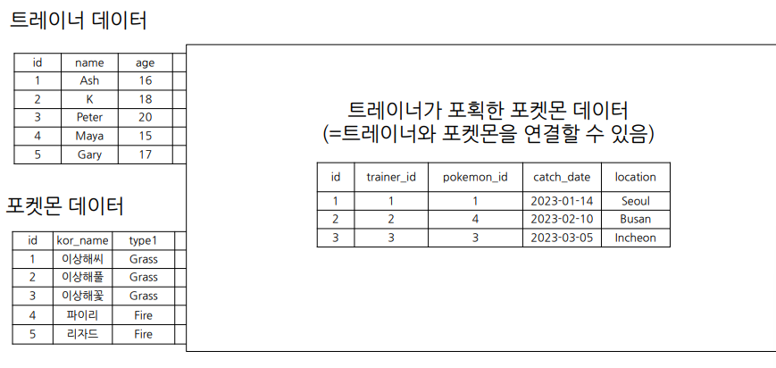
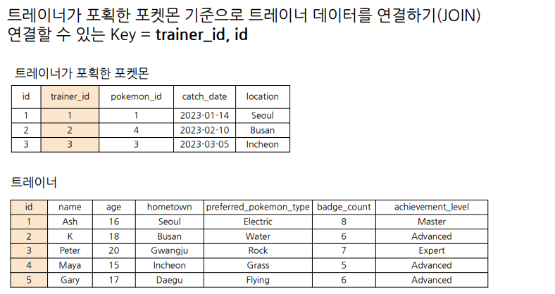
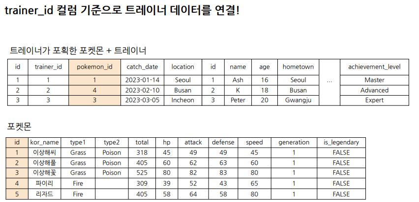

### JOIN을 해야하는 이유 - 데이터 저장되는 형태에 대한 이해

```
- 관계형 데이터베이스(RDBMS) 설계 시 정규화 과정을 거침

여기서 정규화란?
 : 중복을 최소화해서 데이터를 구조화한 것
 - User Table에는 유저 데이터만; Order Table에는 주문 데이터만

- 데이터를 분석하는 관점에서는 미리 JOIN되어 있는 것이 좋겠지만, 개발 관점에서는 분리되어 있는 것이 좋음

- 대신 데이터 웨어하우스에서 JOIN + 필요한 연산을 해서 
“데이터마트”를 만들어서 활용
```

> ## 5-3 다양한 JOIN 방법(LEFT, RIGHT, INNER, CROSS JOIN)
---

### 다양한 SQL JOIN 방법


```
- (INNER) JOIN: 두 테이블의 공통 요소만 연결
- LEFT/RIGHT(OUTER) JOIN: 왼쪽/오른쪽 테이블 기준으로 연결
- FULL(OUTER) JOIN: 양쪽 기준으로 연결
- CROSS JOIN: 두 테이블의 각각의 요소를 곱하기
 : 처음 입력한 데이터를 기준으로 한 행마다 두 번째 데이터를 각각 곱하는 것(아래 사진 참고)

처음에 어렵다면 LEFT JOIN만 주로 사용해도 충분
: 여기서 추가적인 조건을 걸어 INNER JOIN을 할 수 있기 때문
```
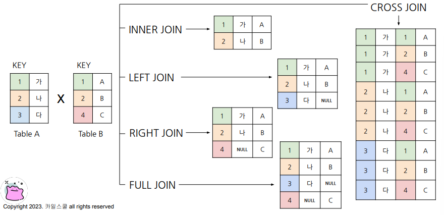

### JOIN 집합 관점으로 생각하기

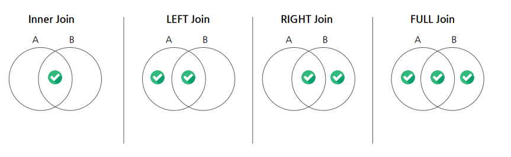

> ## 5-4 JOIN 쿼리 작성하기
---

### SQL JOIN 쿼리 작성하는 흐름

```
LEFT 테이블에 넣으면 좋은 데이터 : ROW수가 적으면서도 내가 원하는 것을 다 포함하는 테이블
```
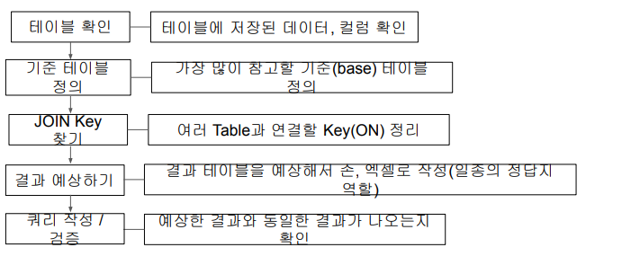

### SQL JOIN 문법

```
FROM 하단에 JOIN할 Table을 작성 및 ON 뒤에 공통된 컬럼(Key)을 작성

SELECT
    A.col1,
    A.col2,
    B.col11,
    B.col12
FROM table1 AS A
LEFT JOIN table2 AS B
ON A.key = B.key #Alias를 사용할 수 있음

여기서 Alias란?
- 테이블 이름이 길 수 있기 때문에 별칭을 정의하는 것
```

### 여러 JOIN별 쿼리 예시

```
CROSS JOIN의 경우 JOIN키가 없어도 연산 가능
```
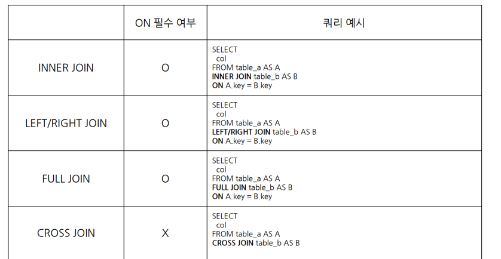

### Big Query에서 JOIN하기

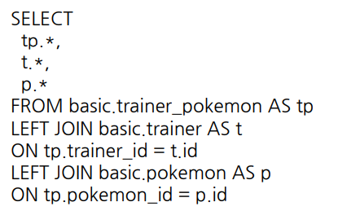

> ## 5-5 JOIN을 처음 공부할 때 헷갈렸던 부분
---

### SQLJOIN을 처음 공부할 때 헷갈렸던 부분

```
1) 여러 JOIN중 어떤 것을 사용해야 할까?

: 하려고 하는 작업의 목적에 따라 JOIN을 선택해보기

2) 컬럼은 모두 다 선택해야 할까?

: 컬럼 선택은 데이터를 추출해서 무엇을 보고자 하는지에 따라 다름
: JOIN이 잘 되었는지 확인하기 위해 처음에는 많은 컬럼을 선택해도 괜찮으나, 사용하지 않을 컬럼은 선택하지 않는 것이 BigQuery에서 비용을 줄일 수 있음
: id 같은 값은 Unique한 지 확인하기 위해서 자주 사용
```

> ## 5-6 JOIN 연습 문제 1~2번
---

1. 트레이너가 보유한 포켓몬들은 얼마나 있는지 알 수 있는 쿼리를 작성

 참고사항 :
 - 보유했다의 정의는 status가 Active,Training인 경우를 의미
 - Released는 방출했다는 것을 의미

    나의 문제 풀이 결과 :
    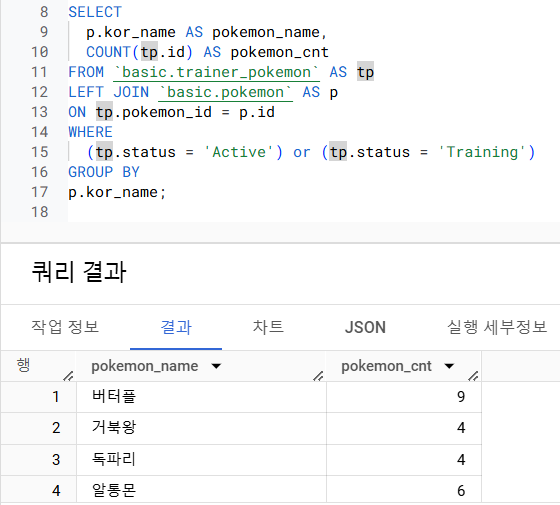

    정답 :
    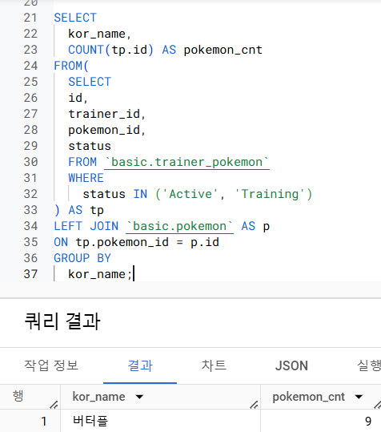

 주의할 점 : 내 문제 풀이가 틀리지는 않았지만, JOIN을 하기 전에 먼저 데이터를 줄이고 하는 것이 빠른 연산에 도움이 됨

2. 각 트레이너가 가진 포켓몬 중에서 'Grass'타입의 포켓몬 수를 계산(단, 편의를 위해 type1기준으로 계산)

    문제 풀이 결과 :
    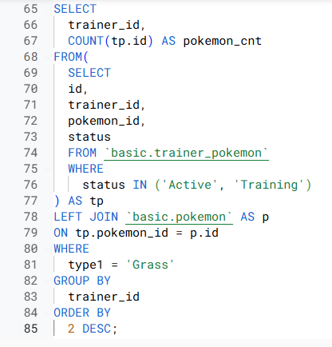

> ## 5-6 JOIN 연습 문제 3~5번
---
3. 트레이너의 고향(hometown)과 포켓몬을 포획한 위치(location)을 비교하여, 자신의 고향에서 포켓몬을 포획한 트레이너의 수를 계산

 참고사항 : 
 - status 상관없이 구하기

    문제 풀이 결과 :
    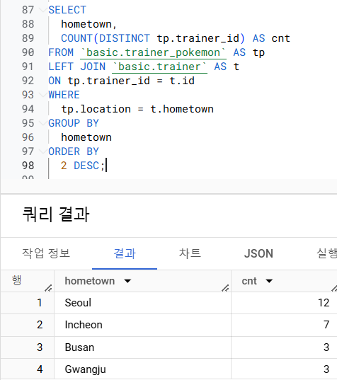

4. Master등급인 트레이너들은 어떤 타입의 포켓몬을 제일 많이 보유하고 있는지 출력

    문제 풀이 결과 :
    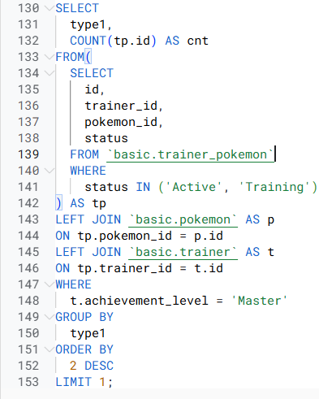

5. Incheon출신 트레이너들은 1세대, 2세대 포켓몬을 각각 얼마나 보유하고 있는지 출력

    문제 풀이 결과 :
    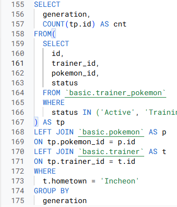

> ## 5-7 정리
---

### JOIN 정리

```
- JOIN : 여러 TABLE을 연결해야 할 때 사용하는 문법
- Key : 공통적으로 가지고 있는 컬럼
```