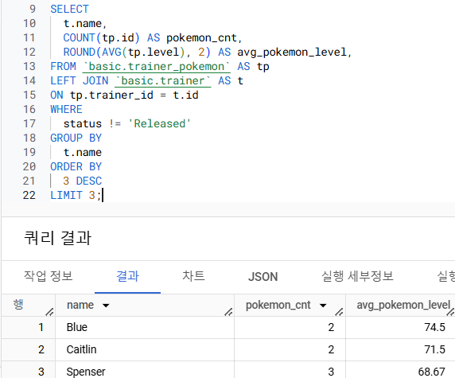
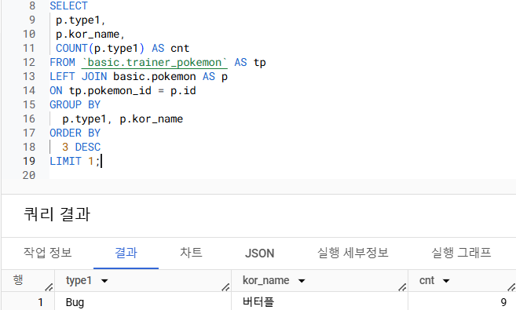
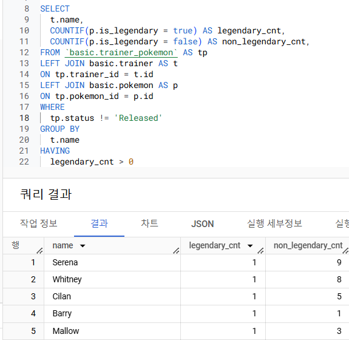
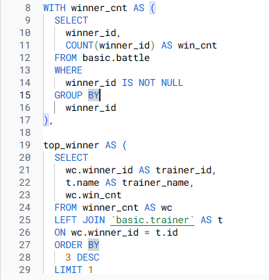
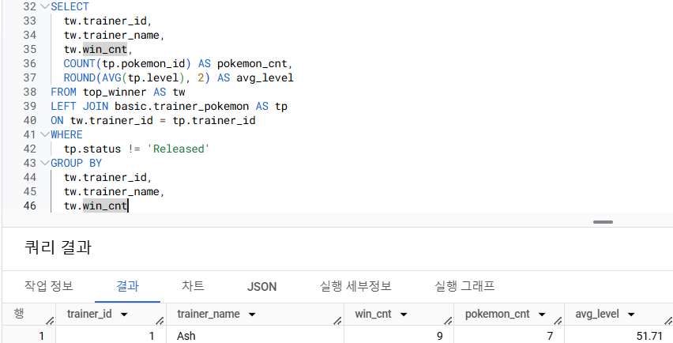
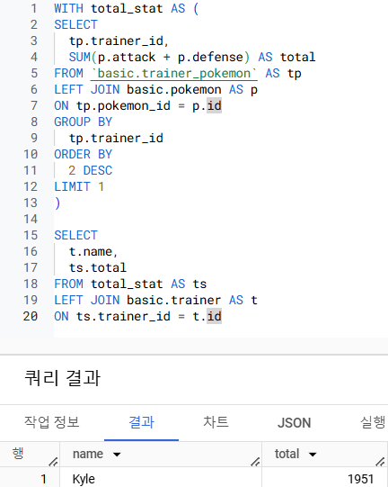
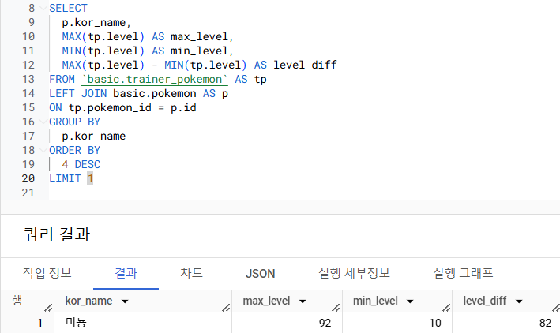
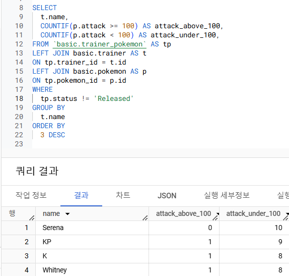

> ## 총 정리 문제 풀이 1~3번
---

1. 각 트레이너별로 가진 포켓몬의 평균 레벨을 계산하고,그 중 평균 레벨이 높은 TOP3 트레이너의 이름과 보유한 포켓몬의 수,평균 레벨을 출력

    문제 풀이 결과:

    

    추가적으로 배워간 부분 :

    SELECT
        DISTINCT
            컬럼명
    : 아래 모든 컬럼의 중복을 제거해서 출력을 해달라는 의미

2. 각 포켓몬 타입1을 기준으로 가장 많이 포획된 (방출 여부 상관없음) 포켓몬의 타입1, 포켓몬의 이름과 포획 횟수를 출력

    문제 풀이 결과:

    

3. 전설의 포켓몬을 보유한 트레이너들은 전설의 포켓몬과 일반 포켓몬을 얼마나 보유하고 있을까? (트레이너의 이름을 같이 출력)

    문제 풀이 결과:

    

    추가적으로 배워간 부분 :

    SUM(CASE WHEN 컬럼 IS TRUE/NOT TRUE)
    : 조건에 해당하는 것만 더하기


> ## 총 정리 문제 풀이 4~5번
---
4. 가장 승리가 많은 트레이너ID, 트레이너의 이름,승리한 횟수, 보유한 포켓몬의 수, 평균 포켓몬의 레벨을 출력. 단,포켓몬의 레벨은 소수점 2째 자리에서 반올림

 참고사항 :
 - 반올림 함수 : ROUND

    문제 풀이 결과:

    
    

5. 트레이너가 잡았던 포켓몬의 총 공격력(attack)과 방어력(defense)의 합을 계산하고, 이 합이 가장 높은 트레이너를 찾기

    문제 풀이 결과:
    

> ## 총 정리 문제 풀이 6번
---

6. 각 포켓몬의 최고 레벨과 최저 레벨을 계산하고,레벨 차이가 가장 큰 포켓몬의 이름을 출력

    문제 풀이 결과:
    

> ## 총 정리 문제 풀이 7번
---

7. 각 트레이너가 가진 포켓몬 중에서 공격력(attack)이 100 이상인 포켓몬과 100미만인 포켓몬의 수를 각각 계산. 트레이너의 이름과 두 조건에 해당하는 포켓몬의 수를 출력

    문제 풀이 결과:
    

> ## 강의를 마치며 학습 내용 전체 총 정리
---

### 초보자를 위한 BigQuery(SQL) 입문 총 정리

```
- 데이터 활용 과정
    - 데이터 탐색 : 조건과 추출 (FROM, WHERE...)
    - 데이터 탐색 : 요약, 집계 (GROUP BY, 집계함수...)
    - 데이터 탐색 : 변환 (숫지, 문자, 날짜 등 여러 데이터의 변환 방법)
        -데이터타입과타입별함수
    - 다양한 자료를 연결 : JOIN
    - 데이터 결과 검증

- SQL쿼리 작성하는 흐름
    - 쿼리 작성 템플릿, 생산성 도구
    - 오류를 디버깅 하는 방법

- BigQuery 공식 문서 확인하는 방법
- 가독성을 챙기기 위한 SQL 스타일 가이드
```

### 앞으로 배우면 좋은 내용

```
- 복잡한 자료형 다루기 : ARRAY,STRUCT
- 복잡한 데이터 가공하기
- BigQuery 결과를 스프레드시트, BI에 연동하기
- 유용한 변환 함수 (윈도우 함수 등)
- 유용한 기능(스크립팅 등)
공식 문서를 토대로 학습하시는 것도 추천:)
```

> ## (데이터 직무를 위한) 사내 BigQuery 교육 가이드
---